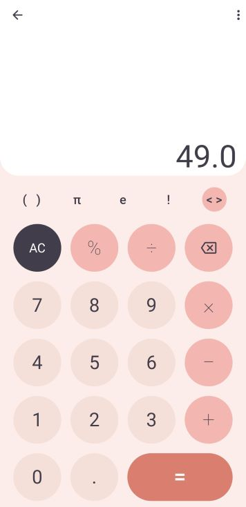

# Material You Calculator
A calculator app based on Google's Material You design. 

### Screenshots

### Preview

##Installation
1. Install Flutter on your machine.
2. Clone the repo.
3. Navigate to the repo on your machine.
4. Connect your device with USB debugging enabled or launch an emulator.
5. Run "flutter run" command.

### APK Link
[Link to APK](https://drive.google.com/file/d/11wQmvbwacRpBp0IWZz9xJBp_n6XyJjlw/view?usp=sharing)
